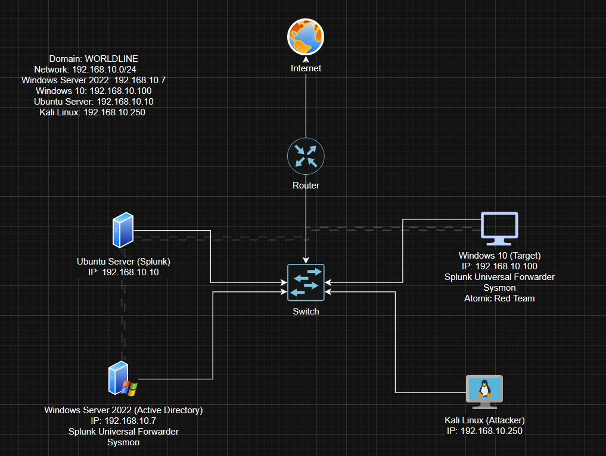

# Introduction

This project simulates a small enterprise network environment focused on cybersecurity monitoring and attack detection.

The lab consists of four virtual machines connected via a virtual switch, which links to a router providing simulated internet access. All machines are part of a custom NAT network (`192.168.10.0/24`):

- **Ubuntu Server** running Splunk Enterprise (SIEM)
- **Windows Server 2022** configured as the Active Directory Domain Controller (ADDC)
- **Windows 10 Pro** endpoint joined to the domain
- **Kali Linux** used for attack simulation

Both Windows machines are configured with **Sysmon** and the **Splunk Universal Forwarder**, and continuously send event logs to the **Ubuntu Splunk server** for centralized collection and analysis.

Simulated attacks are carried out via **Remote Desktop Protocol (RDP)** and **Atomic Red Team**, enabling validation of detections and identification of visibility gaps across the environment.



---

# Environments & Configurations

- **Ubuntu Server 24.04.2** – Hosts Splunk Enterprise for log collection and analysis.

- **Windows Server 2022** – Configured as the Active Directory Domain Controller (AD DC), managing domain users and machines.

- **Windows 10 Pro** – Acts as the target endpoint, joined to the domain. Sysmon and Splunk Universal Forwarder are installed to collect and forward event logs to the Splunk server.  
  Atomic Red Team is also deployed on this machine to simulate adversarial behavior and test detection coverage.

- **Kali Linux** – Used as the attacker machine to simulate intrusions and generate activity on the target system.

All machines are connected through a custom NAT network (`192.168.10.0/24`), allowing isolated communication between them for testing purposes.

Below is a summary table of the machines, their roles, and assigned IP addresses:

| Machine                | Role                     | IP Address         |
|------------------------|--------------------------|--------------------|
| Ubuntu Server 24.04.2  | Splunk Enterprise (SIEM) | 192.168.10.10      |
| Windows Server 2022    | Active Directory (DC)    | 192.168.10.7       |
| Windows 10 Pro         | Target PC                | 192.168.10.100     |
| Kali Linux             | Attacker                 | 192.168.10.250     |

---

# Lab Setup

The virtual environment was created using [VirtualBox](https://www.virtualbox.org/), where four separate virtual machines were installed using official ISO images:

- **Windows 10 Pro** – [Download](https://www.microsoft.com/fr-fr/software-download/windows10)
- **Kali Linux** – [Download](https://www.kali.org/get-kali/#kali-platforms)
- **Windows Server 2022** – [Download](https://www.microsoft.com/fr-fr/evalcenter/download-windows-server-2022)
- **Ubuntu Server 24.04.2** – [Download](https://ubuntu.com/download/server)

After installation, a **custom NAT network** was created using VirtualBox’s network management settings. The network uses the subnet `192.168.10.0/24`. All virtual machines were connected to this isolated NAT network to allow internal communication.

This setup replicates a small enterprise environment for controlled simulation of attacks, event logging, and centralized analysis.

---

# Ubuntu Server Splunk Setup

After installing the Ubuntu Server VM, the first step is to assign a **static IP address** to prevent the server from receiving a different IP on every DHCP lease renewal. This ensures consistent connectivity within the lab network.

To verify the current IP address, let's run:

```bash
ip a
```
Ubuntu Server 24.04 uses Netplan for network configuration. The typical Netplan config file `/etc/netplan/00-installer-config.yaml` might not exist by default. If it's missing, it will be created manually using the command:
```bash
sudo nano /etc/netplan/00-installer-config.yaml
```
Now let's paste the following configuration to `00-installer-config.yaml` to assign a static IP address (192.168.10.10/24) and set the default gateway and DNS:
```yaml
network:
  ethernets:
    enp0s3:
      dhcp4: no
      addresses: [192.168.10.10/24]   # Static IP address
      nameservers:
        addresses: [8.8.8.8]           # DNS server (Google DNS)
      routes:
        - to: default
          via: 192.168.10.1            # Default gateway
  version: 2
```
We save the file and apply the changes with:
```bash
sudo netplan apply
```
The server should now use the static IP 192.168.10.10 on the NAT network. We can check using `ip a`.

---

# Splunk Enterprise Installation (Ubuntu Server)

To begin collecting and analyzing logs, Splunk Enterprise must be installed on the Ubuntu Server.

## 1. Download Splunk

From the host machine:

1. Navigate to [splunk.com](https://www.splunk.com) and sign in or create a new account.
2. Go to **Products → Free Trials and Downloads**
3. Select **Splunk Enterprise** and click **Get My Free Trial**
4. Choose the **Linux** platform and download the `.deb` package (Ubuntu is Debian-based)

Transfer the downloaded `.deb` file to the Ubuntu Server. One way to do this is by using VirtualBox’s **shared folder** functionality.

## 2. Optional: Set Up Shared Folder (for transferring Splunk installer)

> ⚠️ This step is optional and only needed if using a Virtual Machine as it uses VirtualBox addons to move the `.deb` file from the host to the VM. In a real-world server setup, files would be transferred via other methods.

Install the VirtualBox Guest Additions ISO:

```bash
sudo apt-get install virtualbox-guest-additions-iso
```
In the VirtualBox menu:
Go to Devices → Shared Folders → Shared Folder Settings

1.  Click the blue icon with a green plus ➕
2.  Select the folder containing your Splunk .deb file
3.  Enable: ✅ Read-only, ✅ Auto-mount, ✅ Make permanent

Back in the terminal:
```bash
sudo apt-get install virtualbox-guest-utils
sudo reboot
```
After rebooting:
```bash
sudo adduser <your_username> vboxsf
mkdir share
sudo mount -t vboxsf -o uid=1000,gid=1000 <your-shared-folder-name> share/
cd share
```
## 3. Install Splunk

Navigate to the shared folder and run:
```bash
sudo dpkg -i splunk-*.deb
```
Then switch to the Splunk directory:
```bash
cd /opt/splunk
sudo -u splunk bash
cd bin
```
Start Splunk:
```bash
./splunk start
```
- Use Enter or Space to scroll through the license agreement
- Accept with Y
- Set the admin username and password when prompted (save these credentials)

Exit the Splunk user shell:
```bash
exit
```

## 4. Enable Splunk to Start on Boot

To ensure Splunk runs automatically on server startup, we use the following command:
```bash
sudo ./splunk enable boot-start -user splunk
```
Splunk Enterprise is now installed and ready to receive data. The next step is to configure logging on the Windows machines using Sysmon and the Splunk Universal Forwarder.

---

# Windows 10 Configuration and Splunk Universal Forwarder Installation

## 1. Rename PC and Configure Static IP

The target Windows 10 machine is renamed to **TARGET-PC** and configured with a static IP address (192.168.10.100) to ensure consistent network communication within the lab.

## 2. Download and Install Splunk Universal Forwarder

Next, install the Splunk Universal Forwarder (UF) on the Windows 10 machine to forward logs to the Splunk server.

- Visit [splunk.com → Products → Free Trials & Downloads](https://www.splunk.com/en_us/download.html).
- Select **Splunk Universal Forwarder**.
- Choose the appropriate Windows installer:

  - **Windows 10 x64** for 64-bit machines
  - **Windows 10 x86** for 32-bit machines

After downloading the Splunk Universal Forwarder installer, proceed with the following steps:

1. **Launch the installer** and follow the prompts.
2. **Accept the license agreement**, and click **Next**.
3. When prompted for credentials:
   - Set the username to `admin`.
   - Leave **"Generate random password"** checked.
   - Click **Next**.
4. On the **Deployment Server** screen, leave the field **blank** and click **Next**.
5. On the **Receiving Indexer** screen:
   - Enter the **Splunk server IP**: `192.168.10.10`
   - Enter the **port**: `9997`
   - Click **Next**
6. Click **Install** to complete the setup.

Once the Universal Forwarder is installed, the system is ready to begin sending logs to Splunk.

Now that Splunk Universal Forwarder is installed let's install Sysmon.

## Installing Sysmon

**Sysmon (System Monitor)** is a Windows system service and device driver that logs system activity to the Windows Event Log. It's part of the Microsoft Sysinternals Suite and is widely used for advanced event logging.

We’ll install it and configure it using **Olaf Hartong’s `sysmonconfig.xml`**, a community-trusted configuration.

### Step 1: Download Sysmon

1. Visit the official [Microsoft Sysinternals Sysmon page](https://learn.microsoft.com/en-us/sysinternals/downloads/sysmon)
2. Download **Sysmon for Windows**
3. Extract the zip contents

### Step 2: Download Olaf’s Sysmon Config

1. Visit Olaf’s GitHub repo: [https://github.com/olafhartong/sysmon-modular](https://github.com/olafhartong/sysmon-modular)
2. Download the `sysmonconfig.xml` file to the directory where Sysmon is downloaded.

### Step 3: Install and Configure Sysmon

Open a **Powershell as Administrator** and navigate to the folder where `Sysmon64.exe` and `sysmonconfig.xml` are located.

Then run:

```cmd
.\Sysmon64.exe -i sysmonconfig.xml
```

### Step 4: Windows Log Forwarding Configuration

To ensure that important security and system events are collected from Windows machines, the **Splunk Universal Forwarder** is configured to monitor the key Windows Event Logs generated by **Sysmon**.

Open **Notepad as Administrator** and paste the following configuration. Then save the file as `inputs.conf` in: `C:\Program Files\SplunkUniversalForwarder\etc\system\local\`
```ini
[WinEventLog://Application]
index = endpoint
disabled = false

[WinEventLog://Security]
index = endpoint
disabled = false

[WinEventLog://System]
index = endpoint
disabled = false

[WinEventLog://Microsoft-Windows-Sysmon/Operational]
index = endpoint
disabled = false
renderXml = true
source = XmlWinEventLog:Microsoft-Windows-Sysmon/Operational
```

These inputs tell the forwarder to:

1. Monitor Application, Security, and System logs (default Windows logs)
2. Collect Sysmon logs, which provide detailed system activity like process creation and network connections
3. Send all logs to the Splunk endpoint index
4. Use XML format for Sysmon logs to preserve full event details

Restart the Splunk UF Service

To apply the changes, restart the Splunk Universal Forwarder service. To do this, type the following command in a Command Prompt shell:

```cmd
net stop splunkforwarder && net start splunkforwarder
```

This will stop and start the service, applying the new log forwarding configuration.

Now that everything is set up, let's go to a browser and access our Splunk server at 192.168.10.10:8000.

After entering the credentials, the screen should look like this:


Go to Settings, then Indexes, and click on New Index.

We will name it `endpoint` as per Olaf's `inputs.conf` and click **Save**.


To start receiving logs, a port forwarding shall be set up. To do this, we go to **Settings > Forwarding and Receiving**. Click on **Configure Receiving** and then **New Receiving Port**. Then type **9997** and click **Save**.


The configurations should be done by now. To test them, let's go to the **Apps** menu and select **Search & Reporting**.

Type `index="endpoint"` into the search bar and press the search icon.

If all the steps are done correctly, some events like the ones shown below will be displayed.


# Windows Server 2022

Just like the Windows 10 machine, the Windows Server 2022 system also has Sysmon and the Splunk Universal Forwarder installed to ensure comprehensive event logging.

The configuration of Active Directory Domain Services (AD DS) is outside the scope of this documentation. However, you can follow this [official Microsoft guide](https://learn.microsoft.com/en-us/windows-server/identity/ad-ds/deploy/install-active-directory-domain-services--level-100-) for step-by-step instructions on setting up a domain controller.

# Active Directory Domain Join and User Setup

## Domain Join and User Setup

On the Windows Server (ADDC), a **Cybersecurity Department** Organizational Unit was created to manage users within the domain `worldline.local`.

Sample users added:
- **Username:** `ataibi`, `ybouazzaoui`


On the Windows 10 machine:
- The PC was joined to the domain via:
  `System Properties → Computer Name/Domain Changes → Domain: worldline.local`
- Rebooted and logged in as domain user `ybouazzaoui`.

This enables centralized identity management and allows user activity to be monitored via the Splunk platform.

## Simulating an RDP Brute-Force Attack

With RDP enabled on `TARGET-PC` (for testing purposes), the Kali machine was used to simulate brute-force attacks using `xfreerdp3`:

```bash
xfreerdp3 /v:192.168.10.100 /u:ybouazzaoui /p:randompassword
```


As expected the authentication failed and this will usually lead to an unsuccessful authentication attempt and create a 4625 Windows Event ID.

> Windows Security Log Event ID 4625: This is a useful event because it documents each and every failed attempt to logon to the local computer   regardless of logon type, location of the user or type of account. These failed attempts generate Windows Event ID 4625 (failed login).

Let's take another look at Splunk and see if it found any unsuccessful attempts to log in.

On Splunk's search bar:
```spl
index="endpoint" ybouazzaoui
```

Apply a time filter of last 15 minutes. You should see failed login logs with details like source IP and timestamp, confirming Splunk's visibility into authentication events.

## Atomic Red Team

To download ART you can follow this [link](https://github.com/redcanaryco/invoke-atomicredteam/wiki/Installing-Invoke-AtomicRedTeam)

Otherwise lets go directly to the simulation

```powershell
Invoke-AtomicTest T1059.001
```

Each simulation corresponds to a MITRE ATT&CK technique, helping validate detection coverage. All activity is logged via Sysmon and forwarded to Splunk for analysis.

You can search for relevant events using:

```splunk
index="endpoint" sourcetype="XmlWinEventLog:Microsoft-Windows-Sysmon/Operational"
```
